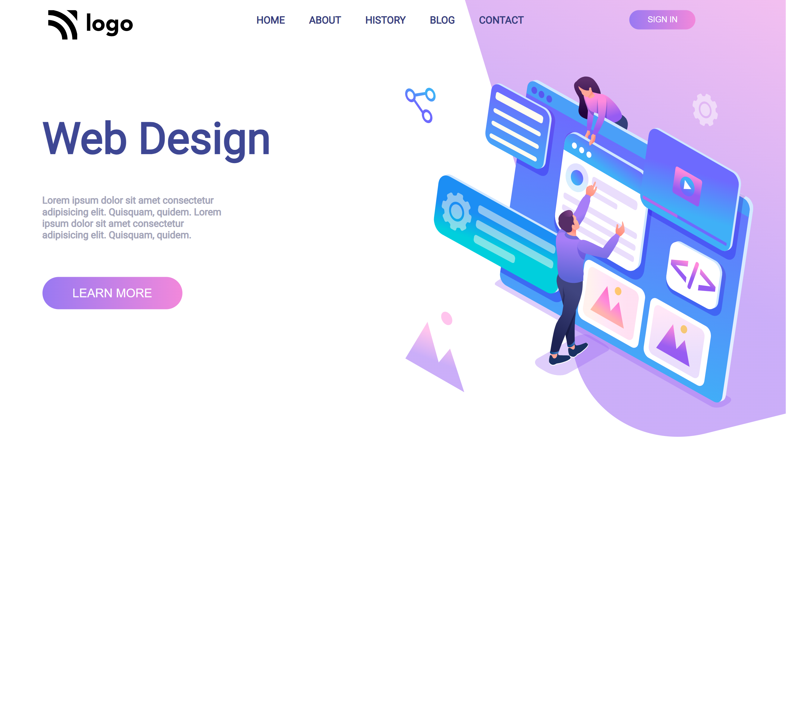

# Landing Page Design

 Hello, My name is __Pratik Dhande__
I created this website using Html and Css. It's my 8th project given as an assignment in **_Full Stack Web Dev Bootcamp  Live Class_**. 

## Live link

 # Skills.

 >  ## 

# Things that i learned
- __a little flexbox__
- __linking images__
- __button-design__
- __Linear-gradient__
- __Css__

# Time taken to finish project

- ## `7 hr` 